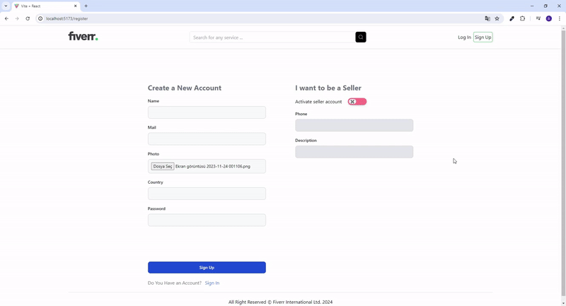

<h1>FIVERR</h1>

Fiverr Clone is a platform developed with the MERN stack. In this project, users can create both seller and regular accounts. Sellers can share their products, and regular users can leave comments and rate these products between 1 and 5 stars.

The frontend utilizes modern technologies such as Vite, React, Axios, Moment, and Tailwind CSS. The backend is powered by Node.js, Express, and MongoDB. Fiverr Clone offers an excellent experience for both buyers and sellers with its user-friendly interface and robust backend architecture.

<h2> Software Languages </h2>

- HTML

- CSS

- JavaScript

<h2> Libraries </h2>

- React

- Express

- Mongoose

- Nodemon

- Axios

- React Router Dom

- Cors

- JWT

- Morgan

- React Query

<h2> Framewoks </h2>

- Tailwind CSS

- Vite

<h3> Minor Libraries </h3>

- Dotenv

- React Toastify

- Moment

- React Icons

- React Splide

<h2> Screen Gif </h2>

